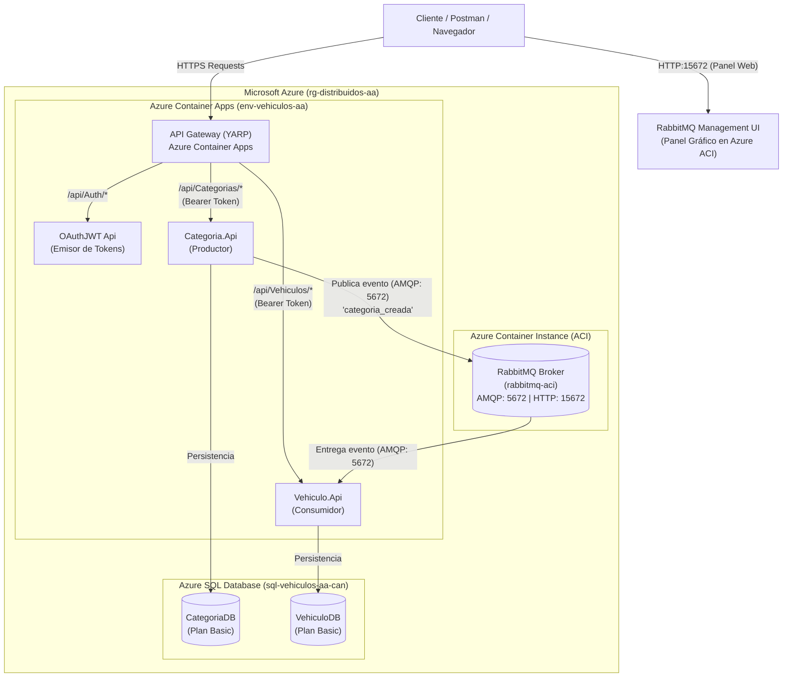

# Trabajo Autónomo: Arquitectura Distribuida Segura y Despliegue en Azure

**Materia:** Aplicaciones Distribuidas  
**Autor:** [Tu Nombre / Estudiante]  
**Fecha de Entrega:** Septiembre 2026  
**Fecha de Disponibilidad de Recursos en Azure:** Hasta el 13/09/2026  

---

## 1. Descripción del Proyecto

Este proyecto implementa una **arquitectura de microservicios distribuida, desacoplada y segura**, ejecutada tanto en entorno local mediante **Docker Compose** como en la nube de **Microsoft Azure** utilizando **Azure Container Apps**, **Azure Container Instances (ACI)**, **Azure Container Registry (ACR)** y **Azure SQL Database**.

### Componentes Principales:
1. **API Gateway (YARP Reverse Proxy):** Único punto de entrada público que enruta el tráfico hacia los microservicios internos.
2. **OAuthJWT Microservicio (.NET 10 Web API):** Servicio centralizado e independiente encargado de la autenticación de usuarios y generación de tokens criptográficos firmados con JWT (JSON Web Tokens).
3. **Categoria.Api (.NET 10 Web API - Productor):** Microservicio para la gestión de categorías de vehículos. Protegido mediante autorización JWT (`Bearer Token`). Al registrar una categoría, publica un evento asíncrono en RabbitMQ.
4. **Vehiculo.Api (.NET 10 Web API - Consumidor):** Microservicio para la gestión de vehículos. Protegido mediante autorización JWT (`Bearer Token`). Posee un consumidor en segundo plano (`BackgroundService`) conectado a RabbitMQ que procesa los eventos y sincroniza la información de categorías.
5. **RabbitMQ (Message Broker en ACI):** Intermediario de mensajería asíncrona desplegado en **Azure Container Instances**, exponiendo simultáneamente el puerto de comunicación interna AMQP (`5672`) y el panel de administración web HTTP (`15672`).
6. **Azure SQL Database:** Bases de datos relacionales independientes (`CategoriaDB` y `VehiculoDB`) en la nube de Azure con aislamiento de esquema por servicio.

---

## 2. Diagrama de Arquitectura



---

## 3. Enlaces Públicos en Microsoft Azure (Recursos Activos)

Los servicios se encuentran desplegados y plenamente operativos en Azure:

| Servicio | URL Pública / Endpoint | Descripción |
| :--- | :--- | :--- |
| **API Gateway** | `https://apigateway.agreeableriver-b258210f.eastus.azurecontainerapps.io` | Puerta de enlace principal para todas las peticiones |
| **OAuthJWT API** | `https://oauthjwt.agreeableriver-b258210f.eastus.azurecontainerapps.io/swagger` | Documentación Swagger del servicio de Login y JWT |
| **Categoria API** | `https://categoria.agreeableriver-b258210f.eastus.azurecontainerapps.io/swagger` | Documentación Swagger de Categorías (Protegido por Bearer) |
| **Vehiculo API** | `https://vehiculo.agreeableriver-b258210f.eastus.azurecontainerapps.io/swagger` | Documentación Swagger de Vehículos (Protegido por Bearer) |
| **RabbitMQ Management** | `http://rabbitmq-vehiculos-aa-2026.eastus.azurecontainer.io:15672` | **Panel gráfico web en vivo en Azure** (User: `admin`, Pass: `admin123`) |

> **Nota:** Todos los recursos estarán activos para validación docente hasta el **domingo 13/09/2026**.

---

## 4. Guía de Ejecución y Pruebas

### A. Ejecución en Entorno Local (Docker Compose)

Para levantar la solución completa con los 5 contenedores en tu máquina local:

```bash
# 1. Clonar el repositorio
git clone <URL_DE_TU_REPOSITORIO>
cd practica-aa-azure

# 2. Levantar todos los servicios
docker compose up --build -d

# 3. Verificar estado de los contenedores
docker compose ps
```

Puertos locales mapeados:
* **API Gateway:** `http://localhost:5010` (o `8080`)
* **OAuthJWT:** `http://localhost:5013/swagger`
* **Categoria.Api:** `http://localhost:5011/swagger`
* **Vehiculo.Api:** `http://localhost:5012/swagger`
* **RabbitMQ Management:** `http://localhost:15672` (Usuario: `admin`, Contraseña: `admin123`)

---

### B. Pruebas de Seguridad y Validación en Azure (Nube)

Puedes probar directamente los endpoints en la nube desde el navegador, PowerShell, cURL o Postman:

#### 1. Iniciar Sesión para Obtener el Token JWT:
```powershell
$loginResponse = Invoke-RestMethod -Uri "https://apigateway.agreeableriver-b258210f.eastus.azurecontainerapps.io/api/Auth/login" `
  -Method Post `
  -ContentType "application/json" `
  -Body '{"usuario":"admin","password":"PasswordSeguro2026!*"}'

$jwtToken = $loginResponse.token
Write-Output "Token obtenido con éxito: $jwtToken"
```

#### 2. Probar Acceso NO Autorizado (Sin Token -> 401 Unauthorized):
```powershell
# Debe retornar error HTTP 401 Unauthorized
curl -i https://apigateway.agreeableriver-b258210f.eastus.azurecontainerapps.io/api/Categorias
```

#### 3. Probar Acceso AUTORIZADO (Con Bearer Token -> 200 OK):
```powershell
# Debe retornar código 200 OK con el listado desde Azure SQL
Invoke-RestMethod -Uri "https://apigateway.agreeableriver-b258210f.eastus.azurecontainerapps.io/api/Categorias" `
  -Method Get `
  -Headers @{ Authorization = "Bearer $jwtToken" }
```

#### 4. Crear Categoría y Verificar Evento en RabbitMQ (Demostración en Vivo):
```powershell
$nuevaCat = @{
    nombre = "Camionetas Blindadas Azure"
    descripcion = "Demostración de evento asíncrono en la nube"
} | ConvertTo-Json

Invoke-RestMethod -Uri "https://apigateway.agreeableriver-b258210f.eastus.azurecontainerapps.io/api/Categorias" `
  -Method Post `
  -ContentType "application/json" `
  -Headers @{ Authorization = "Bearer $jwtToken" } `
  -Body $nuevaCat
```

* **En el panel web de RabbitMQ (`http://rabbitmq-vehiculos-aa-2026.eastus.azurecontainer.io:15672`):** Se observará el conteo de mensajes publicados y entregados en la cola `categoria_creada`.
* **En `Vehiculo.Api` (`https://vehiculo.agreeableriver-b258210f.eastus.azurecontainerapps.io/api/Vehiculos`):** Al consultar la lista, se verá el vehículo creado automáticamente sin intervención manual.

---

## 5. Estructura del Repositorio

```text
practica-aa-azure/
├── ApiGatewayVehiculos/      # Proyecto YARP API Gateway (.NET 10)
├── BaseDatos/                # Scripts DDL y DML para Azure SQL Database
│   ├── CategoriaDB.sql
│   └── VehiculoDB.sql
├── Categoria.Api/            # Microservicio Categoria (Productor RabbitMQ)
├── OAuthJWT/                 # Microservicio de Autenticación y Emisión de JWT
├── Vehiculo.Api/             # Microservicio Vehiculo (Consumidor RabbitMQ)
├── CLAVES_AZURE_EJEMPLO.txt  # Plantilla de variables de entorno (sin credenciales reales)
├── MEMORIA_COMANDOS_AZURE.txt# Historial de comandos Azure CLI ejecutados en el despliegue
├── docker-compose.yml        # Orquestación de contenedores para entorno local
└── README.md                 # Documentación del proyecto y enlaces en vivo
```

---

## 6. Control de Costos y Eliminación de Recursos en Azure

Para cumplir con el presupuesto establecido (< $5 USD) y las instrucciones de la práctica:
* Se utilizaron los planes mínimos: **Azure Container Registry (Basic)** y **Azure SQL Database (Basic - 5 DTUs)**.
* Azure Container Apps y Azure Container Instances utilizan consumo optimizado con asignación base.
* Al finalizar el período de evaluación académica (13/09/2026), se debe ejecutar el siguiente comando para **destruir todos los recursos y detener la facturación por completo**:

```bash
az group delete --name rg-distribuidos-aa --yes --no-wait
```
